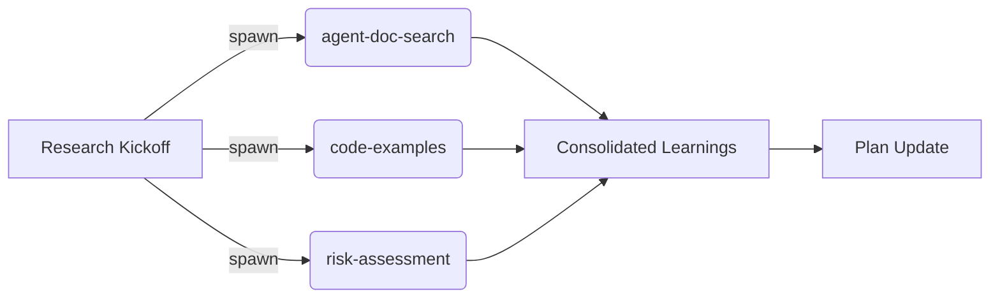
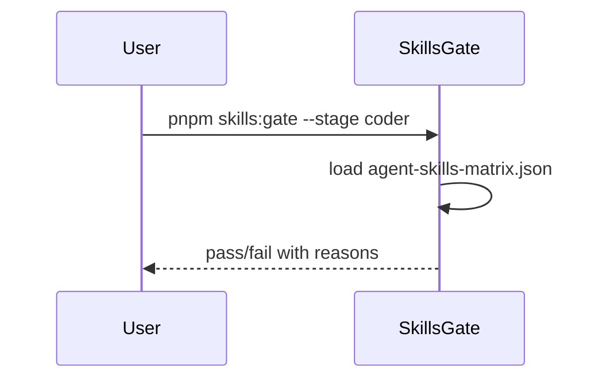

# Agent Orchestration Workflow

The Burlaki orchestration revolves around a modular, role-aware workflow that keeps every stage accountable, traceable, and aligned to the source of truth. This document covers the lifecycle from ideation to operations, the gatekeeping rules, and the supplemental tooling that keeps skills, research, and git checkpoints validated.

## Workflow Phases

### Sequence Overview
```
burlaki-start → workflow:brainstorm → workflow:plan → workflow:prd → burlaki-run
```

- **burlaki-start** launches a new story, collects metadata, and seeds context for the downstream workflow. It typically reads the active `agent-skills-matrix.json` and current backlog state to decide participants.
- **workflow:brainstorm** is ideation: agents explore scope, surface constraints, and start an informal backlog. Outputs include rough objectives, risk notes, and candidate solutions that feed planning.
- **workflow:plan** translates brainstorming into actionable tickets. It refines responsibilities, estimates, and assigns preliminary owners, then emits a draft PRD (work-in-progress). This stage prepares the structured config consumed by the PRD workflow.
- **workflow:prd** formalizes requirements. It consumes `.agents/tasks/prd.json` as the source of truth, grounding scope, acceptance criteria, and critical data. Agents validate assumptions, reference templates, and mark the PRD ready for execution.
- **burlaki-run** executes the change: coding agents build features, testers author validations, and the release plan is enacted. Run hooks may spawn parallel sub-agents for verification or documentation.

### Phase Hand-offs
- Each transition is mediated through standard prompts and shared data files. For example, `workflow:plan` writes a draft PRD into `.agents/tasks/prd.json` that `workflow:prd` later validates and locks.
- Metadata (owner, stage, blockers) flows through environment variables or designated config snippets that agents read before responding.
- Hand-offs include explicit readiness signals (e.g., `PRD ready? yes`) and status updates (`burlaki-status` tracking) so subsequent agents know when to proceed.

### Source of Truth: `.agents/tasks/prd.json`
- This JSON file captures the approved PRD, including objectives, metrics, implementation notes, and acceptance criteria.
- Every downstream phase (especially `workflow:prd` and `burlaki-run`) reads this file to ensure agents operate on the same understanding.
- PRD edits require rerunning the skill-gate and status flows, preventing stale requirements from propagating.

## Skills Gate Validation

### Purpose
`pnpm skills:gate -- --matrix ./agent-skills-matrix.json --stage <stage>` ensures only qualified agents act during each phase.

### What It Checks
- Matches agent skill sets against `agent-skills-matrix.json` requirements (skill name and level). Missing or inadequate skills block progression.
- Validates `agentConstraints`: `allowedAgents` white-lists permitted agent types, `forbiddenSwarmSkills` stops specific swarm collaborators from participating (e.g., disallowing `codex` from using `coding-agent`).

### Stages and Constraints
- `manager`: brainstorming leadership, must include planning & governance skills.
- `coder`: requires implementation, architecture, and testing skills. `coding-agent` is allowed; `codex` must follow forbidden swarm restrictions.
- `tester`: emphasizes verification, QA, and regression expertise.
- `reviewer`: focuses on code review, documentation, and quality gating.
- `devops`: ensures deployment, monitoring, and rollback mastery.

### Agent Constraints Example
```json
{
  "allowedAgents": ["claude"],
  "forbiddenSwarmSkills": {"codex": ["coding-agent"]},
  "forbiddenSwarmAgents": {"codex": ["codex"]}
}
```

## burlaki-status Workflow

- Tracks active stories by polling `.agents/tasks/prd.json`, git refs, and in-flight stages.
- Reports current phase, blockers, and Git checkpoints using human-readable updates.
- Validates PRD readiness by ensuring required sections exist and that previous skills-gate steps succeeded.

### Git Checkpoints
- Each milestone (brainstorm complete, plan approved, PRD locked) tags the git timeline with logs or annotated commits.
- `burlaki-status` compares HEAD with checkpoints to detect drift or missing commits, prompting revalidation before new stages.

## burlaki-deepen-plan

- Spins up parallel research agents to gather data, reference docs, and surface new requirements.
- Includes skills discovery: agents introspect what skills are needed and annotate `agent-skills-matrix.json` for future gates.
- Learnings are applied back into `workflow:plan`/`workflow:prd` via updated context and new PRD entries.

### Parallel Research Diagram


## Diagrams

### Workflow Flow
```mermaid
flowchart TD
  S[burlaki-start]
  B[workflow:brainstorm]
  P[workflow:plan]
  R[workflow:prd]
  X[burlaki-run]

  S --> B --> P --> R --> X
  R --> |writes| "`.agents/tasks/prd.json`"
  X --> |reads| "`.agents/tasks/prd.json`"
```

### Skills Gate Sequence


## Typical Workflow Example

1. **Manager stage**: `burlaki-start` launches a story, `workflow:brainstorm` captures scope, runs `pnpm skills:gate --stage manager`.
2. **Planning**: `workflow:plan` generates `.agents/tasks/prd.json`, runs `burlaki-deepen-plan` to gather risks, and `workflow:prd` revalidates the PRD.
3. **Execution**: `burlaki-status` confirms git checkpoints and PRD validation before `burlaki-run` starts coding/testing with the coder/tester skill gates.

## Notes
- Keep `.agents/tasks/prd.json` authoritative: any change means rerunning status and skills gate flows.
- Use `burlaki-status` before each major phase to ensure git history and PRD state align.
